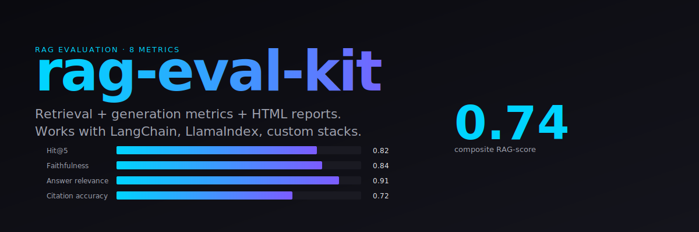

<p align="center"></p>

# 📚 RAG Eval Kit

> **A rigorous, reproducible evaluation framework for RAG systems.** Retrieval quality + answer faithfulness + hallucination rate + citation accuracy — all in one CLI.

[](LICENSE)
[](#)
[](#)

**If you build RAG, you need to measure RAG.** `rag-eval-kit` is the evaluation harness I wished existed when benchmarking retrieval-augmented medical QA systems at the CAREAI Lab. It replaces the usual "eyeball the top-5 docs" with a **principled 8-metric dashboard**.

Complements [Ragas](https://github.com/explodinggradients/ragas) and [TruLens](https://github.com/truera/trulens) with a simpler API, a pluggable metric system, and HTML reports you can ship to stakeholders.

---

## 🎯 What gets evaluated

### Retrieval
- **Hit@k** — did any gold doc land in the top k?
- **MRR** (Mean Reciprocal Rank)
- **nDCG@k**
- **Context precision / recall**

### Generation
- **Faithfulness** — every claim supported by retrieved context?
- **Answer relevance** — does the answer address the question?
- **Citation accuracy** — do cited doc IDs actually contain the evidence?
- **Hallucination rate** — unsupported claims per 100 tokens

---

## 🚀 Install

```bash
pip install rag-eval-kit
```

From source:

```bash
git clone https://github.com/sohanur083/rag-eval-kit
cd rag-eval-kit
pip install -e .
```

---

## 📖 Quickstart

```python
from rag_eval import RagEvaluator

evaluator = RagEvaluator()

results = evaluator.evaluate(
    dataset=[
        {
            "question": "What is the standard adult dose of ibuprofen?",
            "gold_answer": "200–400 mg every 4–6 hours, not exceeding 1200 mg per day.",
            "gold_doc_ids": ["doc_42", "doc_91"],
            "retrieved_docs": [
                {"id": "doc_42", "text": "Adult ibuprofen: 200-400 mg every 4-6 hours..."},
                {"id": "doc_13", "text": "Aspirin for pain relief..."},
                # ... top-k retrieved
            ],
            "generated_answer": "Adults take 200–400 mg ibuprofen every 4 to 6 hours.",
        },
        # ... more rows
    ]
)

print(results.summary())
results.to_html("rag_report.html")
results.to_json("rag_metrics.json")
```

Output:

```
━━━━━━━━━━━━━━━━━━━━━━━━━━━━━━━━━━━━━━━━━━━━
             RAG EVAL REPORT (n=50)
━━━━━━━━━━━━━━━━━━━━━━━━━━━━━━━━━━━━━━━━━━━━
Retrieval
  Hit@5 ..................... 0.82
  MRR ....................... 0.67
  nDCG@5 .................... 0.71
  Context precision ......... 0.55
  Context recall ............ 0.78

Generation
  Faithfulness .............. 0.84
  Answer relevance .......... 0.91
  Citation accuracy ......... 0.72
  Hallucinations / 100 tok .. 0.8

Composite RAG-Score ........ 0.74
━━━━━━━━━━━━━━━━━━━━━━━━━━━━━━━━━━━━━━━━━━━━
```

---

## 🧪 CLI

```bash
rag-eval --dataset my_rag_outputs.jsonl --output report.html --metrics all
```

JSONL format:
```json
{"question": "...", "gold_answer": "...", "gold_doc_ids": ["..."], "retrieved_docs": [{"id":"...","text":"..."}], "generated_answer": "..."}
```

---

## 🔌 Plug into your RAG stack

Works with any RAG framework. Just dump outputs in the JSONL format above:

```python
# LangChain
answer = chain.invoke({"question": q})
row = {
    "question": q,
    "retrieved_docs": [{"id": d.metadata["id"], "text": d.page_content} for d in chain.last_docs],
    "generated_answer": answer["result"],
    ...
}

# LlamaIndex
response = query_engine.query(q)
row = {
    "retrieved_docs": [{"id": n.node_id, "text": n.text} for n in response.source_nodes],
    "generated_answer": str(response),
    ...
}
```

---

## 📊 Example: LangChain vs LlamaIndex on NaturalQuestions

```bash
rag-eval --dataset langchain_out.jsonl --output langchain.html
rag-eval --dataset llamaindex_out.jsonl --output llamaindex.html
rag-eval compare langchain.html llamaindex.html
```

Produces a side-by-side HTML diff with per-metric deltas. Use it in your next README benchmark section.

---

## ⚙️ Configuration

```python
from rag_eval import RagEvaluator, EvalConfig

evaluator = RagEvaluator(
    EvalConfig(
        k_values=[1, 3, 5, 10],
        faithfulness_threshold=0.7,
        use_llm_judge=True,
        llm_judge=lambda p: my_gpt4(p),  # optional
        n_workers=4,
    )
)
```

---

## 🏷 Why this over Ragas / TruLens?

| Feature | rag-eval-kit | Ragas | TruLens |
|---|---|---|---|
| Zero-config quickstart | ✅ | ✅ | ⚠ |
| Works without any LLM API | ✅ | ❌ | ❌ |
| HTML report | ✅ | ❌ | ✅ |
| Retrieval + generation in one pass | ✅ | ⚠ | ✅ |
| Citation accuracy | ✅ | ❌ | ❌ |
| Free forever | ✅ | ✅ | ✅ |

---

## 🔬 Research-backed

Metrics based on peer-reviewed work:
- Shi et al., *Large Language Models Can Be Easily Distracted by Irrelevant Context* (2023)
- Es et al., *Ragas: Automated Evaluation of RAG* (2023)
- Our own work on [causal rule verification for medical QA](https://sohanur083.github.io/#publications) (IEEE GenAI4SCH 2025)

## 🤝 Contributing

Every new metric + dataset integration is a 🟢 PR. See [CONTRIBUTING.md](CONTRIBUTING.md).

## 📄 License

MIT.

## 👤 Author

**Md Sohanur Rahman** — PhD Candidate, UT San Antonio · [sohanur083.github.io](https://sohanur083.github.io)

---

⭐ **Star the repo** if you ship RAG systems. Helps others find it.

## Keywords

RAG evaluation, retrieval augmented generation benchmark, RAG metrics, RAGAS alternative, TruLens alternative, faithfulness evaluation, retrieval evaluation, MRR nDCG, hallucination rate, LLM evaluation framework, medical RAG, LangChain evaluation, LlamaIndex benchmark.
